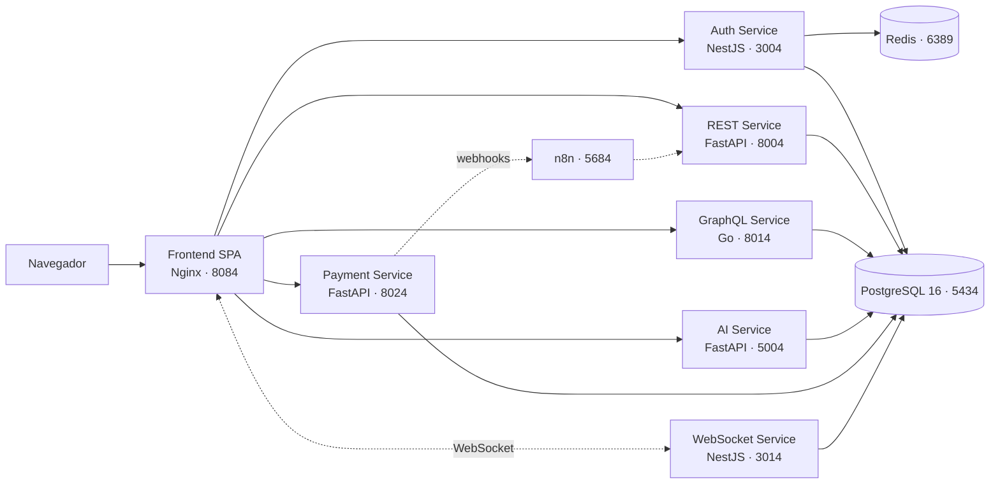

# ReservasUleam

[](https://github.com/Angel17jc/ReservasUleam2025/releases)
[](#-licencia)
[](https://github.com/Angel17jc/ReservasUleam2025/commits/main)
[](#-instalación)
[](#-requisitos-previos)
[](#-requisitos-previos)

> Sistema institucional de gestión y reserva de espacios físicos y aulas de la **Universidad Laica Eloy Alfaro de Manabí (ULEAM)**.

---

## 📖 Descripción

**¿Qué es?**
ReservasUleam es una plataforma web de microservicios que centraliza la reserva de espacios físicos universitarios —aulas, laboratorios, auditorios y canchas— desde la solicitud del estudiante hasta la aprobación administrativa, el cobro (cuando aplica) y la notificación en tiempo real.

**¿Por qué existe?**
El proceso actual es **manual, lento y propenso a choques de horarios**: las solicitudes viajan por correo o papel, nadie tiene una vista única de la disponibilidad y dos reservas pueden ocupar el mismo espacio a la misma hora. ReservasUleam resuelve esto con:

| Problema | Solución del sistema |
| :--- | :--- |
| Doble reserva del mismo espacio | Validación de solapamiento en el servicio de reservas + control transaccional en PostgreSQL |
| Disponibilidad opaca | Consultas de disponibilidad vía **GraphQL** con filtros por fecha, tipo y capacidad |
| Aprobaciones lentas | Flujos automatizados con **n8n** y eventos bidireccionales entre servicios |
| Usuario sin feedback | Notificaciones **WebSocket** en vivo del estado de cada reserva |
| Consultas repetitivas al personal | Asistente conversacional (**AI Service**) con acceso a herramientas del sistema |

---

## 🏗️ Arquitectura y Stack Tecnológico

El proyecto es un **monorepo políglota** compuesto por seis microservicios independientes, un frontend SPA y una capa de orquestación de procesos.



### Componentes

| Capa | Componente | Tecnología | Responsabilidad |
| :--- | :--- | :--- | :--- |
| **Frontend** | `UleamFront` | React 18 · TypeScript · Vite · TailwindCSS · Radix UI · TanStack Query · Wouter | SPA responsiva, compilada a estáticos y servida por **Nginx** |
| **Backend** | `auth-service` | NestJS · TypeScript · TypeORM · Passport JWT | Registro, login, emisión/rotación de JWT, roles y sesiones |
| **Backend** | `rest-service` | Python 3.11 · FastAPI · SQLAlchemy · Alembic | Núcleo de negocio: espacios, categorías, reservas, usuarios |
| **Backend** | `graphql-service` | Go 1.21 · net/http | Consultas agregadas de disponibilidad y reportes |
| **Backend** | `ai-service` | Python 3.11 · FastAPI · Groq / Gemini · MCP Tools | Asistente conversacional multimodal con *function calling* |
| **Backend** | `payment-service` | Python 3.11 · FastAPI · Alembic · HMAC | Cobros, integración B2B por API Key y webhooks firmados |
| **Backend** | `websocket-service` | NestJS · Socket.IO | Notificaciones y eventos en tiempo real |
| **Datos** | `postgres` | PostgreSQL 16 | Persistencia (bases separadas por dominio) |
| **Datos** | `redis` | Redis 7 | Caché de sesiones y *rate limiting* del Auth Service |
| **Orquestación** | `n8n` | n8n 1.64.3 | Automatización de flujos, recordatorios y notificaciones |

---

## ✅ Requisitos Previos

Al ejecutarse **íntegramente en contenedores**, solo necesitas tres herramientas en tu máquina:

| Herramienta | Versión mínima | Verificar con |
| :--- | :--- | :--- |
| **Docker Engine** | 24.0+ | `docker --version` |
| **Docker Compose** | v2.20+ (plugin `docker compose`) | `docker compose version` |
| **Git** | 2.40+ | `git --version` |

> [!NOTE]
> **No necesitas instalar Node.js, Python, Go ni PostgreSQL localmente.** Las imágenes base (`node:20-alpine`, `python:3.11-slim`, `golang:1.21-alpine`, `postgres:16-alpine`, `nginx:alpine`) proveen todos los runtimes. Las versiones quedan fijadas en el `Dockerfile` de cada servicio.

**Recursos recomendados:** 8 GB de RAM libres y 10 GB de disco (son 9 contenedores).

---

## 🚀 Instalación

### 1. Clonar el repositorio

```bash
git clone https://github.com/Angel17jc/ReservasUleam2025.git
cd ReservasUleam2025
```

### 2. Crear el archivo de entorno

```bash
cp .env.example .env
```

Edita `.env` y completa los valores obligatorios (ver [Configuración](#️-configuración-variables-de-entorno)).

> [!IMPORTANT]
> **`JWT_SECRET` debe ser idéntico en todos los servicios.** Auth emite los tokens y REST, GraphQL, AI, Payment y WebSocket los validan con la misma clave; un valor distinto provoca `401 Unauthorized` en cascada.
> Genera uno seguro con: `openssl rand -hex 32`

### 3. Construir las imágenes

```bash
docker compose build
```

La primera construcción descarga las imágenes base y compila el frontend; puede tardar varios minutos.

### 4. Levantar el ecosistema completo

```bash
docker compose up -d
```

### 5. Aplicar las migraciones del servicio de pagos

```bash
docker compose exec payment-service alembic upgrade head
```

> [!NOTE]
> **Solo `payment-service` necesita este paso.** El esquema del núcleo (`reservasuleam`), las tablas de autenticación y los datos de ejemplo se cargan **automáticamente** la primera vez que se crea el volumen de PostgreSQL, desde los scripts montados en `/docker-entrypoint-initdb.d/`:
>
> | Orden | Script | Contenido |
> | :---: | :--- | :--- |
> | `00` | [`docker/postgres/init/00-databases.sql`](docker/postgres/init/00-databases.sql) | Crea `ai_service_db` y `payment_service_db` |
> | `01` | [`UleamBack/database/init.sql`](UleamBack/database/init.sql) | 12 tablas del núcleo + datos de ejemplo |
> | `02` | [`UleamBack/auth-service/create_auth_tables.sql`](UleamBack/auth-service/create_auth_tables.sql) | `refresh_token` y columnas de bloqueo de cuenta |
> | `03` | [`docker/postgres/init/03-grants.sql`](docker/postgres/init/03-grants.sql) | Permisos sobre las tres bases |
>
> El `ai-service` crea sus propias tablas al arrancar. Si necesitas reinicializar desde cero: `docker compose down -v && docker compose up -d`.

**Usuarios de ejemplo cargados** (contraseña `password123` en los tres):

| Rol | Email |
| :--- | :--- |
| Administrador | `admin@uleam.edu.ec` |
| Profesor | `profesor1@uleam.edu.ec` |
| Estudiante | `estudiante1@uleam.edu.ec` |

### 6. Verificar que todo esté arriba

```bash
docker compose ps
```

Todos los servicios deben reportar `healthy` o `running`. Abre entonces **http://localhost:8084**.

### 7. Detener el entorno

```bash
docker compose down          # Detiene y elimina los contenedores
docker compose down -v       # Además borra los volúmenes (datos de PostgreSQL)
```

---

## 🔌 Mapa de Puertos

> [!WARNING]
> **Este proyecto NO utiliza puertos estándar.** Está diseñado para convivir con otros entornos de desarrollo en la misma máquina, por lo que evita deliberadamente `3000`, `3306`, `5432`, `8000` y `8080`. Se adopta la **familia de puertos terminados en `4`**. No modifiques estos valores sin actualizar también los `*_SERVICE_URL`, los `VITE_*` y `CORS_ORIGINS` del archivo `.env`.

| Servicio | Puerto host | Puerto interno | URL local | Puerto estándar evitado |
| :--- | :---: | :---: | :--- | :--- |
| **Frontend (Nginx)** | `8084` | `80` | http://localhost:8084 | ~~8080~~ |
| **Auth Service** | `3004` | `9000` | http://localhost:3004 | ~~3000~~ |
| **REST Service** | `8004` | `8000` | http://localhost:8004/docs | ~~8000~~ |
| **GraphQL Service** | `8014` | `8081` | http://localhost:8014/graphql | ~~4000~~ |
| **AI Service** | `5004` | `5000` | http://localhost:5004/api/v1/docs | ~~5000~~ |
| **Payment Service** | `8024` | `8001` | http://localhost:8024/api/v1/docs | ~~8001~~ |
| **WebSocket Service** | `3014` | `3001` | ws://localhost:3014 | ~~3001~~ |
| **PostgreSQL** | `5434` | `5432` | `localhost:5434` | ~~5432~~ / ~~3306~~ |
| **Redis** | `6389` | `6379` | `localhost:6389` | ~~6379~~ |
| **n8n** | `5684` | `5678` | http://localhost:5684 | ~~5678~~ |

**Comunicación interna:** dentro de la red Docker los servicios se llaman por **nombre de servicio y puerto interno** (ej. `http://rest-service:8000`), nunca por `localhost`. Los puertos de la columna *host* existen únicamente para tu acceso desde el navegador o Postman.

---

## ⚙️ Configuración (Variables de Entorno)

Se utiliza **un único archivo `.env` centralizado en la raíz** del repositorio. Docker Compose lo lee y distribuye las variables a cada contenedor; **no crees archivos `.env` por servicio**.

> [!CAUTION]
> El archivo `.env` **nunca** debe subirse al repositorio. Ya está cubierto por [`.gitignore`](.gitignore). Versiona únicamente `.env.example` con valores ficticios.

### Estructura de `.env.example`

```dotenv
# ==========================================================
# GENERAL
# ==========================================================
NODE_ENV=development
ENVIRONMENT=development
LOG_LEVEL=INFO

# ==========================================================
# BASE DE DATOS  (PostgreSQL 16 - puerto host 5434)
# ==========================================================
POSTGRES_USER=reservas_uleam
POSTGRES_PASSWORD=<contrasena-local-fuerte>
POSTGRES_DB=reservasuleam
DB_HOST=postgres
DB_PORT=5432

# URLs por dominio ('postgres' es el nombre del servicio en Docker)
DATABASE_URL=postgresql+psycopg://reservas_uleam:<password>@postgres:5432/reservasuleam
AUTH_DATABASE_URL=postgresql://reservas_uleam:<password>@postgres:5432/auth_service_db
AI_DATABASE_URL=postgresql+psycopg://reservas_uleam:<password>@postgres:5432/ai_service_db
PAYMENT_DATABASE_URL=postgresql+psycopg://reservas_uleam:<password>@postgres:5432/payment_service_db

# ==========================================================
# SEGURIDAD / JWT  (idéntico en TODOS los servicios)
# ==========================================================
JWT_SECRET=<generar-con-openssl-rand-hex-32>
SECRET_KEY=<mismo-valor-que-JWT_SECRET>
ALGORITHM=HS256
ACCESS_TOKEN_EXPIRE_MINUTES=15
REFRESH_TOKEN_EXPIRE_DAYS=7
COOKIE_SECURE=false          # true obligatorio en producción (HTTPS)
COOKIE_SAMESITE=lax

# ==========================================================
# COMUNICACIÓN ENTRE SERVICIOS (red interna de Docker)
# ==========================================================
AUTH_SERVICE_URL=http://auth-service:9000
REST_SERVICE_URL=http://rest-service:8000
GRAPHQL_SERVICE_URL=http://graphql-service:8081
AI_SERVICE_URL=http://ai-service:5000
PAYMENT_SERVICE_URL=http://payment-service:8001
WEBSOCKET_SERVICE_URL=http://websocket-service:3001
INTERNAL_PROVISION_TOKEN=<secreto-interno-auth-a-rest>
RESERVAS_INTERNAL_TOKEN=<secreto-interno-payment-a-rest>

# ==========================================================
# CORS  (orígenes del navegador: puertos del HOST)
# ==========================================================
CORS_ORIGINS=http://localhost:8084

# ==========================================================
# FRONTEND  (inyectadas por Vite en tiempo de build)
# ==========================================================
VITE_REST_BASE_URL=http://localhost:8004
VITE_AUTH_BASE_URL=http://localhost:3004
VITE_GRAPHQL_URL=http://localhost:8014/graphql
VITE_AI_SERVICE_URL=http://localhost:5004
VITE_PAYMENT_BASE_URL=http://localhost:8024
VITE_WS_URL=http://localhost:3014

# ==========================================================
# PROVEEDORES DE IA  (AI Service)
# ==========================================================
DEFAULT_LLM_PROVIDER=groq
GROQ_API_KEY=<tu-api-key>
GEMINI_API_KEY=<tu-api-key>
MAX_FILE_SIZE_MB=10

# ==========================================================
# PAGOS  (Payment Service)
# ==========================================================
MOCK_PROVIDER_ENABLED=true
STRIPE_API_KEY=<sk_test_...>
STRIPE_WEBHOOK_SECRET=<whsec_...>
WEBHOOK_MAX_RETRIES=3
RATE_LIMIT_PER_MINUTE=60

# ==========================================================
# CACHÉ Y ORQUESTACIÓN
# ==========================================================
REDIS_URL=redis://redis:6379
N8N_WEBHOOK_URL=http://n8n:5678/webhook
```

### Variables obligatorias

| Variable | Servicios que la consumen | Notas |
| :--- | :--- | :--- |
| `POSTGRES_PASSWORD` | Todos | Sin valor por defecto; el arranque falla si falta |
| `JWT_SECRET` / `SECRET_KEY` | Auth, REST, GraphQL, AI, Payment, WebSocket | Mínimo 32 caracteres; **debe coincidir en todos** |
| `DATABASE_URL` | REST, AI, Payment | Driver `psycopg` v3 |
| `INTERNAL_PROVISION_TOKEN` | Auth → REST | Sincronización interna de usuarios |
| `GROQ_API_KEY` *o* `GEMINI_API_KEY` | AI | Al menos uno, según `DEFAULT_LLM_PROVIDER` |

---

## 📁 Estructura del Proyecto

```text
ReservasUleam2025/
├── docker-compose.yml            # Orquestador único de todo el ecosistema
├── .env.example                  # Plantilla de variables (copiar a .env)
│
├── UleamFront/                   # SPA React + TypeScript (build → Nginx)
│   ├── Dockerfile                #   Multi-stage: node:20 (build) → nginx:alpine
│   ├── nginx.conf                #   Server block, gzip y fallback SPA
│   ├── vite.config.ts
│   └── client/
│       ├── index.html
│       └── src/
│           ├── api/              #   Clientes HTTP: rest/ · graphql/ · websocket/
│           ├── components/       #   UI reutilizable (auth, chat, layouts, ui)
│           ├── pages/            #   Vistas por ruta
│           ├── router/           #   Rutas y guards por rol
│           ├── contexts/         #   Estado global (sesión, tema)
│           └── hooks/
│
├── UleamBack/                    # Microservicios
│   ├── auth-service/             #   NestJS - JWT, roles, sesiones
│   │   └── src/                  #     controllers · guards · database
│   ├── rest-service/             #   FastAPI - núcleo de reservas
│   │   ├── app/                  #     routes · models · schemas · services
│   │   └── alembic/              #     Migraciones de esquema
│   ├── graphql-service/          #   Go - disponibilidad y reportes
│   │   ├── cmd/                  #     Punto de entrada
│   │   └── internal/             #     resolvers · config · auth
│   ├── ai-service/               #   FastAPI - asistente conversacional
│   │   └── app/                  #     routes · adapters · mcp/ (tools)
│   ├── payment-service/          #   FastAPI - cobros e integración B2B
│   │   ├── app/                  #     routes · providers · webhooks
│   │   └── tests/
│   ├── websocket-service/        #   NestJS + Socket.IO - tiempo real
│   │   └── src/modules/
│   └── n8n-workflows/            #   Flujos exportados (JSON) versionados
│
├── database/                     # Esquema inicial y parches SQL
│   ├── setup_postgres.sql
│   └── patches/
│
└── docs/                         # Documentación técnica por pilar
```

---

## 📜 Scripts Principales

### Comandos Docker (uso diario)

| Comando | Descripción |
| :--- | :--- |
| `docker compose up -d` | Levanta los 9 servicios en segundo plano |
| `docker compose up -d --build` | Reconstruye las imágenes y levanta (tras cambiar dependencias) |
| `docker compose down` | Detiene y elimina contenedores (conserva los datos) |
| `docker compose down -v` | Elimina también los volúmenes: **borra la base de datos** |
| `docker compose ps` | Estado y salud de cada contenedor |
| `docker compose logs -f <servicio>` | Sigue los logs en vivo (ej. `logs -f rest-service`) |
| `docker compose restart <servicio>` | Reinicia un solo servicio |
| `docker compose exec <servicio> sh` | Abre una shell dentro del contenedor |

### Scripts internos por servicio

Se ejecutan **dentro del contenedor** con `docker compose exec <servicio> <comando>`.

| Servicio | Comando | Para qué sirve |
| :--- | :--- | :--- |
| `frontend` | `npm run build` | Compila la SPA a estáticos (`dist/`) |
| `frontend` | `npm run check` | Verificación de tipos con TypeScript |
| `frontend` | `npm run test:run` | Suite de pruebas con Vitest |
| `frontend` | `npm run test:coverage` | Reporte de cobertura del frontend |
| `auth-service` | `npm run start:dev` | Modo *watch* de NestJS |
| `auth-service` | `npm run migration:run` | Aplica migraciones de TypeORM |
| `auth-service` | `npm run migration:generate` | Genera una migración desde las entidades |
| `auth-service` | `npm run test:cov` | Pruebas Jest con cobertura |
| `rest-service` | `alembic upgrade head` | Aplica migraciones al esquema de reservas |
| `rest-service` | `alembic revision --autogenerate -m "msg"` | Crea una nueva migración |
| `rest-service` | `pytest` | Suite de pruebas del núcleo de negocio |
| `payment-service` | `alembic upgrade head` | Migraciones del esquema de pagos |
| `payment-service` | `pytest -v` | Pruebas de cobros y webhooks |
| `graphql-service` | `go build ./cmd/...` | Compila el binario del servicio |
| `graphql-service` | `go test ./...` | Pruebas del servicio Go |

### Endpoints de verificación

| Servicio | Health check | Documentación interactiva |
| :--- | :--- | :--- |
| Frontend | — | http://localhost:8084 |
| Auth | *(no expone `/health`)* | http://localhost:3004/api/v1/docs (Swagger) |
| REST | *(no expone `/health`)* | http://localhost:8004/docs (Swagger) |
| GraphQL | http://localhost:8014/health | http://localhost:8014/graphql |
| AI | http://localhost:5004/api/v1/health | http://localhost:5004/api/v1/docs |
| Payment | http://localhost:8024/api/v1/health | http://localhost:8024/api/v1/docs |
| n8n | — | http://localhost:5684 |

---

## 🔐 Seguridad y Privacidad de Datos

### Autenticación y autorización

- **Tokens JWT** firmados con `HS256`, emitidos por el `auth-service` y validados por los demás servicios con el mismo `JWT_SECRET`.
- **Cookies seguras** como transporte del token: `HttpOnly` (inaccesible desde JavaScript, mitiga XSS), `Secure` (solo HTTPS en producción vía `COOKIE_SECURE=true`) y `SameSite=Lax` (mitiga CSRF).
- **Access token de vida corta** (15 min) con **refresh token** rotatorio de 7 días.
- **Separación estricta de roles:**

  | Rol | Permisos |
  | :--- | :--- |
  | **Administrador** | Gestión de espacios y categorías, aprobación/rechazo de reservas, reportes globales, administración de usuarios |
  | **Estudiante** | Consulta de disponibilidad, creación y cancelación de sus **propias** reservas, historial personal |

  La autorización se aplica en el **backend** mediante *guards* y dependencias por rol. Los controles del frontend son de experiencia de usuario, **nunca** la frontera de seguridad.
- **Comunicación interna** entre servicios protegida con secretos compartidos (`INTERNAL_PROVISION_TOKEN`, `RESERVAS_INTERNAL_TOKEN`); los webhooks del `payment-service` van firmados con **HMAC**.
- **Rate limiting** activo en los endpoints sensibles (`RATE_LIMIT_PER_MINUTE`), respaldado por Redis.
- **Contraseñas** almacenadas con hash **bcrypt**; jamás en texto plano ni reversibles.

### Protección de datos personales — LOPDP (Ecuador)

El tratamiento de la información de estudiantes y personal se rige estrictamente por la **Ley Orgánica de Protección de Datos Personales (LOPDP) del Ecuador** y su reglamento. En consecuencia:

| Principio LOPDP | Aplicación en el sistema |
| :--- | :--- |
| **Finalidad** | Los datos se recolectan **exclusivamente** para gestionar reservas de espacios institucionales; no se destinan a otro fin ni se ceden a terceros |
| **Minimización / proporcionalidad** | Solo se almacenan los datos indispensables: nombre, correo institucional, rol y cédula cuando la normativa lo exija |
| **Confidencialidad y seguridad** | Hash bcrypt de credenciales, secretos fuera del código y acceso a la base de datos restringido a la red interna de Docker |
| **Calidad y exactitud** | El titular puede rectificar sus datos desde su perfil |
| **Derechos ARCO** *(acceso, rectificación, eliminación, oposición, portabilidad)* | El sistema debe permitir al titular consultar, corregir y solicitar la supresión de sus datos personales |
| **Conservación limitada** | Los registros históricos de reservas se depuran o anonimizan una vez cumplida su finalidad institucional |
| **Responsabilidad proactiva** | Trazabilidad de accesos y operaciones sensibles mediante logs estructurados |

> [!CAUTION]
> **Nunca uses datos reales de estudiantes en entornos de desarrollo o pruebas.** Emplea siempre datos sintéticos o debidamente anonimizados. Los volcados de base de datos con información personal no deben salir de la infraestructura institucional ni versionarse.

### Reglas obligatorias para colaboradores

1. **Ningún secreto en el repositorio:** ni en el código, ni en archivos `.env`, ni en scripts de prueba.
2. **Rota de inmediato cualquier credencial expuesta** y purga el archivo del historial (`git filter-repo`); añadirlo a `.gitignore` no basta si ya fue versionado.
3. **HTTPS obligatorio** en cualquier despliegue fuera de `localhost`, con `COOKIE_SECURE=true`.
4. **Revisa `CORS_ORIGINS`** antes de desplegar: nunca uses `*`.

---

## 📄 Licencia

**Licencia Académica / Cerrada.** Desarrollo institucional de la Universidad Laica Eloy Alfaro de Manabí. Todos los derechos reservados. Su uso, copia, modificación o distribución fuera del ámbito institucional requiere autorización expresa y por escrito.

---

<div align="center">
  <sub>Universidad Laica Eloy Alfaro de Manabí · ReservasUleam 2025</sub>
</div>
